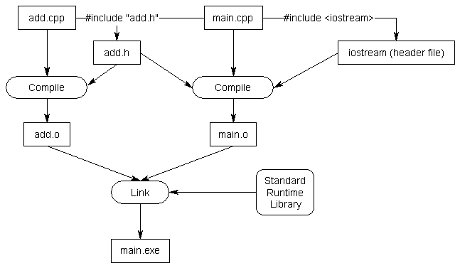

# Header Files

When the preprocessor process the `#include "add.h"` line in `add.cpp` and `main.cpp`, it copies the contents of the `add.h` file to the top
of the respective files. That is, the forward declaration of `add` will be copied to the top of those files. The end
result is the exact same as if we included the forward declaration of `add` in both of these files. You can see how for larger projects,
header files help reduce the number of times we need to write forward declarations and reduce tedious tasks dealing with types, etc. 



# Including definitions of functions in header files violates the 'One Definition Rule'

If we wrote the definition of the `add` function in the `add.h` header file, the definition of `add` would be included in
multiple source files (even if we removed the `#include "add.h"` from the `add.cpp` file). While compiling, the `add.cpp` and
the `main.cpp` would compile independently, so those two files will compile just fine. When the linker runs, it'll see two definitions
of the function `add`, which will cause an error. 

# Source files should include their paired header

it's best practice for source code files to #include their paired header file, if it exists, because this allows the compiler to catch certain errors before the linking phase. For example,

### something.h
```
int something(int);
```
### something.cpp
```
void something(int) { ... }; // error wrong return type
```
The compiler will notice when copying the forward declaration in `something.h` to `something.cpp` that the function `something` has a mismatches return type and throw 
a compile error. If `something.cpp`, didn't include `something.h` we'd have to wait until the linker discovered the discrepancy. 